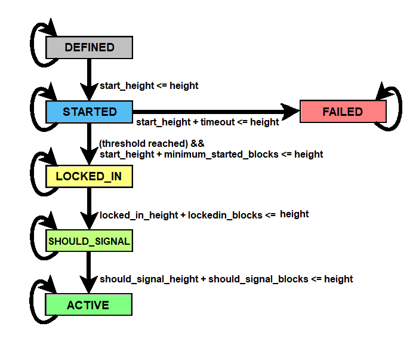
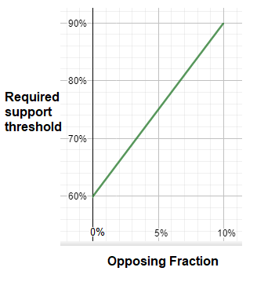

```
 BIP: TBD
  Title: Deployment with trinary version signaling
  Author: Billy Tetrud <billy.tetrud@gmail.com>
  Comments-Summary: No comments yet.
  Comments-URI: TBD
  Status: Final
  Type: Informational
  Created: 2021-05-15
  License: BSD-3-Clause: OSI-approved BSD 3-clause license
```

## Abstract

This document specifies an alternative to [BIP8](https://github.com/bitcoin/bips/blob/master/bip-0008.mediawiki) and [BIP9](https://github.com/bitcoin/bips/blob/master/bip-0009.mediawiki) for deploying soft fork changes to Bitcoin. A primary difference from both BIP8 and BIP9 is that this proposal uses tri-state version signaling (rather than binary version bits) that can encode both active support as well as active opposition to an active soft fork. This proposal adopts BIP8's block-height-based milestones (as opposed to BIP9's use of block timestamps). 

## Motivation

Both BIP9 and BIP8 define mechanisms to support multiple concurrent bitcoin soft-forks. However, BIP9 has been criticized as not being sufficient to incentivize "lazy" miners to upgrade their software. BIP8 attempts to remedy this by introducing a lock-in-on-timeout (LOT=true) mode where miner signaling can only serve to activate sooner but activation will eventually occur even without any miner signaling. However because LOT=true provides no mechanism for permanent rejection, this can result in a soft fork happening even if it causes substantial fractions of the network to diverge in the fork. 

This proposal aims to provide a flexible middle ground between BIP8 with LOT=true vs BIP8 with LOT=false and BIP9 where lazy miners will have minimal ability to delay or block upgrades while still allowing active contention to cause activation to be delayed or to permanently fail. The option of permanent failure is important in cases where significant problems are found, including problems like a significant section of stake holders have been ignored or misunderstood. The goal of this proposal is to allow for faster upgrading via both providing more information about miner intentions towards the upgrade, as well as by providing additional incentive for miners to put in the effort to upgrade their software (either in order to signal support or to signal opposition). 

## Specification

### Parameters

Each soft fork deployment is specified by the following per-chain parameters (further elaborated below):

1. The **name** specifies a very brief description of the soft fork, reasonable for use as an identifier.
2. The **slot** determines which bits in the nVersion field of the block are to be used to signal about soft fork support or opposition. The slot is chosen from the set {0,1,2,...,15}. 
3. The **start_height** specifies the height of the first block at which the bit gains its meaning.
4. The **minimum_started_blocks** specifies the minimum number of blocks that must remain in STARTED state. No block before the block at height `start_height + minimum_activation_blocks` may become LOCKED_IN. 
5. The **lockedin_blocks** specifies the number of blocks that must remain in LOCKED_IN state, once the LOCKED_IN state begins before any block can be considered in SHOULD_SIGNAL state.
6. **should_signal_blocks** specifies the number of blocks that must remain in SHOULD_SIGNAL state, once transitioning from the LOCKED_IN state, before any block can be considered in ACTIVE state.
7. The **timeout** specifies a number of blocks after the start_height at which the miner signaling ends. If the soft fork has not yet locked in when the block `start_height + timeout` has been reached, the deployment is considered failed on all descendants of the block.
8. The **min_threshold** specifies the minimum number of approval-signaling blocks required in a retarget period for lock-in of the upgrade, in the case where no opposition signaling exists in a given retargeting period.
9. The **max_threshold** specifies the maximum number of approval-signaling blocks required in a retarget period for lock-in of the upgrade, in the case where `2016 - max_threshold` blocks are signaling active opposition.

### Selection guidelines

The following guidelines are suggested for selecting these parameters for a soft fork:

1. **name** should be selected such that no two soft forks, concurrent or otherwise, ever use the same name. For deployments described in a single BIP, it is recommended to use the name "bipN" where N is the appropriate BIP number.
2. **slot** should be selected such that no two concurrent soft forks use the same slot. The slot chosen should not overlap with active usage (legitimately or otherwise) for other purposes. A later deployment using the same slot is possible as long as the start_height is after the previous one's timeout or activation, but it is discouraged until necessary, and even then recommended to have a pause in between to detect buggy software.
3. **start_height** should be set to some block height after the expected release date of the software that includes the activation parameters. 
4. **minimum_started_blocks** should be set to at least the length of several retarget periods and should be set with the intention of giving the majority (50%) of economic activity enough time to upgrade to software including the activation parameters. A reasonable setting would be 2 retargeting periods (1 month).
5. **lockedin_blocks** should be set to at least the length of several retarget periods and should be set with the intention of giving the vast majority (90%) of economic activity enough time to upgrade to software supporting the upgrade. A reasonable setting would be 4 retargeting periods (2 months).
6. **should_signal_blocks** should be set to the length of at least one retarget period, with the intention of giving the vast majority (90%) of the remaining non-signaling nodes to upgrade their software. A reasonable setting would be 2 retargeting periods (1 month)
7. **timeout** should be set such that it is considered reasonable to expect the entire economy to upgrade in that time. Probably at least 26 retarget periods (1 year).
8. The **min_threshold** should be 1210 blocks (60% of 2016), or 1008 (50%) for testnet.
9. The **max_threshold** should be 1815 blocks (90% of 2016), or 1512 (75%) for testnet.

**start_height**, **timeout**, **minimum_started_blocks**, **lockedin_blocks**, and **should_signal_blocks** must be exact multiples of 2016 (ie, at a retarget boundary).

### States

With each block and soft fork, we associate a deployment state. The possible states are:

1. **DEFINED** is the first state that each soft fork starts out as. The genesis block is by definition in this state for each deployment.
2. **STARTED** for blocks at or beyond the start_height. A soft fork remains in STARTED state until at least `minimum_started_blocks` have passed since the start_height.
3. **LOCKED_IN** for at least one retarget period after the first retarget period with STARTED blocks from which a number of blocks exceeding the threshold have the associated ternary slot set in nVersion. A soft fork remains in LOCKED_IN until `lockedin_blocks` have passed.
4. **SHOULD_SIGNAL** for at least one retarget period after the first retarget period with LOCKED_IN blocks. A soft fork remains in SHOULD_SIGNAL state until `should_signal_blocks` have passed. During this state, miners should only mine on blocks not signaling support for the upgrade if the hash of the block modulo 8 equals 0.
5. **ACTIVE** for all blocks after the `should_signal_blocks` in SHOULD_SIGNAL state have passed.
6. **FAILED** for all blocks after the `timeout` if LOCKED_IN has not been reached.

### Bit flags

The nVersion block header field is to be interpreted as a 32-bit little-endian integer (as present). The block will be considered to be signaling in compliance with this BIP if and only if nVersion's highest order bits are `010`.

The first 24 lowest-order bits will be used to represent ternary version signaling values. Bits 24 through 28 are left undefined for future use.

The ternary values encoded in bits 0 through 23 are decoded by separating bits 0 through 23 into three sets of 8 bits: bits 0 through 7, bits 8 through 15, and bits 16 through 23. Each set of 8 bits is then converted to a list of 5 ternary values, and these 3 sets of 5 ternary values are concatenated into the list of ternary values for use in version signaling. 

The meaning for each ternary value is as follows:

* 0 - No signal (not signaling).
* 1 - Support the change.
* 2 - Oppose the change. 

Miners should continue setting the slot in LOCKED_IN phase so uptake is visible, though this has no effect on consensus rules.

### New consensus rules

The new consensus rules for each soft fork are enforced for each block that has ACTIVE state.

### State transitions



The genesis block has state DEFINED for each deployment, by definition.

```
    State GetStateForBlock(block) {
        if (block.height == 0) {
            return DEFINED;
        }
```

All blocks within a retarget period have the same state. This means that if `floor(block1.height / 2016) = floor(block2.height / 2016)`, they are guaranteed to have the same state for every deployment.

```
        if ((block.height % 2016) != 0) {
            return GetStateForBlock(block.parent);
        }
```

Otherwise, the next state depends on the previous state:

```
        switch (GetStateForBlock(GetAncestorAtHeight(block, block.height - 2016))) {
```

We remain in the initial state until we reach the start block height.

```
        case DEFINED:
            if (block.height >= start_height) {
                return STARTED;
            }
            return DEFINED;
```

After a period in the STARTED state, we tally the slot set, and transition to LOCKED_IN if a sufficient number of blocks in the past period set the deployment slot in their version numbers. If the threshold hasn't been met and we reach the timeout, we transition directly to FAILED.

Note that a block's state never depends on its own nVersion; only on that of its ancestors.

```
        case STARTED:
            if (start_height + timeout <= block.height) {
                return FAILED;
            }
            if (start_height + minimum_started_blocks <= block.height) {
            	int supportCount = 0;
	            int opposeCount = 0;
    	        walk = block;
        	    for (i = 0; i < 2016; i++) {
            	    walk = walk.parent;
                	if (walk.nVersion & 0xE0000000 == 0x10000000) {
                		int signal = getSignalForSlot(walk.nVersion, slotNumber);
	                	if (signal == 1) {
    	                    ++supportCount;
        	            } else if (signal == 2) {
            	            ++opposeCount;
                	    }
	                }
    	        }
	            if (thresholdReached(supportCount, opposeCount, min_threshold, max_threshold)) {
	            	lockedin_height = block.height;
	                return LOCKED_IN;
    	        }
    	    }
            return STARTED;
```

After `lockedin_blocks`, we automatically transition to SHOULD_SIGNAL. Otherwise LOCKED_IN continues.

```
        case LOCKED_IN:
            if (lockedin_height + lockedin_blocks <= block.height) {
                return SHOULD_SIGNAL;
            } else {
                return LOCKED_IN;
            }
```

After `should_signal_blocks`, we automatically transition to ACTIVE. Otherwise SHOULD_SIGNAL continues.

```
        case SHOULD_SIGNAL:
            if (lockedin_height + lockedin_blocks + should_signal_blocks <= block.height) {
                return ACTIVE;
            } else {
                return SHOULD_SIGNAL;
            }
```

And ACTIVE and FAILED are terminal states, which a deployment stays in once they're reached.

```
        case ACTIVE:
            return ACTIVE;
        case FAILED:
            return FAILED;
        }
    }
```

The signal slot is calculated by finding the ternary digit from the nVersion bits.

```
int getSignalForSlot(int nVersion, int slotIndex) {
  int bucket = slotNumber / 5;
  int bucketIndex = slotNumber % 5;
  int relevantBits = (nVersion >> 8 * bucket) | 0xFF;

  for(var n=0; n<bucketIndex; n++) {
    relevantBits = relevantBits / 3;
  }
  
  return relevantBits % 3;
}
```

The required threshold is calculated depending on the amount of opposition signals.

````
bool thresholdReached(int supportCount, int opposeCount, int min_threshold, int max_threshold) {
  int maxPassingOpposition = 2016 - max_threshold;
  int requiredThreshold = min_threshold +
                         (max_threshold-min_threshold)*opposeCount/maxPassingOpposition;
  return supportCount >= requiredThreshold;
}
````

The threshold calculated above has a linear relationship with the fraction of opposing signals. The following assumes the recommendations for `min_threshold` and `max_threshold` are used. If there is no opposition, only 60% support is needed to lock in the upgrade. If 5% of blocks are signaling opposition, 75% support signaling is required to lock in the upgrade. And if 10% of blocks are signaling opposition, all other 90% of blocks must be signaling support for the upgrade to lock in. This relationship both allows non-contentious upgrades to upgrade relatively easily and quickly while still allowing opposition to the upgrade to make lock in of the upgrade more difficult or fail entirely. 



#### Implementation notes

It should be noted that the states are maintained along block chain branches, but may need recomputation when a reorganization happens.

### Warning mechanism

To support upgrade warnings, the signaling slots will all be checked for any signaling for slots without any related known update. Whenever LOCKED_IN for an unknown upgrade is detected, the software should warn loudly about the upcoming soft fork. It should warn even more loudly once the upcoming fork is in the ACTIVE state.

### getblocktemplate changes

The template request Object's `rules` and the template Object's `rules` will also include the relevant names of softfork deployments using this BIP.

The template Object is also extended:

| template       |          |        |                                                              |
| -------------- | -------- | ------ | ------------------------------------------------------------ |
| Key            | Required | Type   | Description                                                  |
| slotsavailable | Yes      | Object | Set of pending, supported soft fork deployments adhering to this BIP; each uses the soft fork name as the key, and the soft fork slot number as its value. |
| slotsrequired  | No       | Number | Bit mask of soft-fork deployment slots signaling version support. Only the lowest order 15 bits will be non zero. Each bit position corresponds to the slot number. |
| slotsrejected  | No       | Number | Bit mask of soft-fork deployment slots signaling version opposition. Only the lowest order 15 bits will be non zero. Each bit position corresponds to the slot number. |

The "version" key of the template is retained, and used to indicate the server's preference of deployments. If this BIP is being adhered to, "version" must be formatted as specified in the *Bit flags* section above. Miners MAY clear or set bits in the block version WITHOUT any special "mutable" key, provided they are listed among the template's "slotsavailable", (when clearing is desired) NOT included as a bit in "slotsrequired", and (when setting is desired) NOT included as a bit in "slotsrejected". 

Soft fork deployment names listed in "rules" or as keys in "slotsavailable" may be prefixed by a '!' character and interpreted as in BIP9. 

"slotsavailable", "slotsrequired", and "slotsrejected" are mutually exclusive with "vbavailable" and "vbrequired". If deployments that signal with ternary slots are used, "vbavailable" should return an empty object and "vbrequired" should return 0, and similarly in the reverse case. 

### Reference implementation

TBD

## Contrasted with BIP 9

- Block heights are used for the deployment monotonic clock, rather than median-time-past.
- Only 15 slots simultaneous upgrades are possible, vs 29 simultaneous upgrades.
- In the most restrictive case, lock-in happens at 90% as opposed to BIP9's 95%, and lock-in can happen at substantially lower support signaling than that if there is little opposition. 
- Has `minimum_started_blocks`, `lockedin_blocks`, and `should_signal_blocks` settings to allow reasonable time between state changes.
- Has a SHOULD_SIGNAL state to give a financial warning to stragglers to upgrade their node before the deployment becomes ACTIVE.

## Contrasted with BIP 8

- Only 15 slots simultaneous upgrades are possible, vs 29 simultaneous upgrades.
- Lock-in can happen at significantly lower support signaling than BIP8's 90% supermajority requirement if there is little opposition. 
- No LOT=true option. 
- A combination of `minimum_started_blocks`, `lockedin_blocks`, and `should_signal_blocks` are used to determine activation height in a relative way instead of the absolute  `minimum_activation_height` setting.
- Has a SHOULD_SIGNAL state to give a financial warning to stragglers to upgrade their node before the deployment becomes ACTIVE. This was inspired by the MUST_SIGNAL state in BIP8.

## Backwards compatibility

Because this specification does not use nVersions with the top bits `001`, it can not overlap with deployments following BIP8 and BIP9. This BIP's specified upgrade signaling mechanism is mutually exclusive with BIP8 and BIP9, which means that if BIP8 or BIP9 has an active deployment, this BIP cannot be used, and vice versa. 

## Forwards compatibility

Patterns of nVersion involving the top bits `011` as well as the meaning of bits 24 through 28 are left open for future use.

### **Modified thresholds**

The thresholds do not have to be maintained for eternity, but changes should take the effect on the warning system into account. In particular, having a `lockedin_blocks` that is incompatible with the one used for the warning system may have long-term effects, as the warning system cannot rely on a permanently detectable condition anymore.

## Rationale

* Why is 60% signaling recommended as the `min_threshold`? 	
  * 60% is a supermajority amount greater enough than 50% to be unlikely to be a fluke and also unlikely to change in the near future - i.e. if 60% of blocks signal support the upgrade now, its very unlikely that less than 50% of mining hashpower supports the upgrade and also very unlikely that less than 50% of mining hashpower would support the upgrade anytime in the next couple years.
* Why is 90% signaling recommended as the `max_threshold`?
  * BIP8 recommends this value and Taproot's deployment also used this threshold. This BIP does not seek to change that standard in the case that substantial opposition arises.
* What is the rationale for the recommendations for `minimum_started_blocks`, `lockedin_blocks`, and `should_signal_blocks`?
  * Time should be given at each state for the community to react including having discussion and performing upgrade procedures. Its expected that the fastest miners to upgrade will be much faster than the slowest, which is why the `minimum_started_blocks` is substantially shorter than `lockedin_blocks + should_signal_blocks`. 
* What is the SHOULD_SIGNAL state for? 
  * The SHOULD_SIGNAL state is intended to be a clear monetary signal to non-upgraded miners that they must upgrade or lose their revenue stream. Because almost 12.5% of non-supporting blocks will be orphaned, non-signaling miners and mining pools should be alerted to the issue by any system that helps them monitor their revenue and the health of their mining system. Even if they have not been paying attention to the progression of the soft-fork, they should at this point be spurred to look into the issue. 
* How might the SHOULD_SIGNAL state affect the orphan rate and reorg risk?
  * In the near-worst case scenario, at least 60% of miners would be signaling support, leading to approximately 5% of all blocks being orphaned, which would lead to only about 5 two-block reorgs happening in a relevant retargeting period and a 6 block reorg would remain very very unlikely (< 4 chances in 10,000 retarget periods). 

## Alternative Designs

### Coexistence with BIP8 and BIP9

This BIP could be changed such that some nVersion bits are assigned for use as specified in BIP8/BIP9 and other nVersion bits are allocated for use as trinary signaling data. It seems that this would only be useful in the case that ongoing BIP9/BIP8 soft forks are in progress while people want a soft fork using trinary signaling to begin or in the case that some soft forks prefer to use BIP9/BIP8 for some reason. 

## Deployments

A living list of deployment proposals: TBD.

## References

TBD

## Copyright

This document is licensed under the 3-clause BSD license.